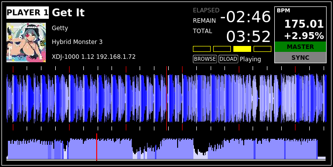
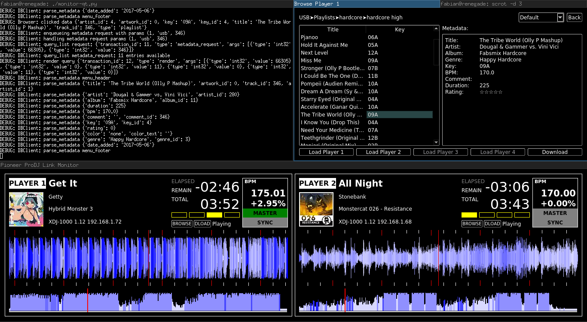

# Python ProDJ Link



This is a set of python scripts to participate in a Pioneer ProDJ Link system.
It is particularly useful to monitor whats happening on the players, but can also help by syncing other devices using midi clock.
The code to detect your own mac and ip addresses is os dependant and **only implemented on linux** for now.

The Qt GUI is useful to perform light shows and react to events in the music.

## Getting Started

These instructions will get you a copy of the project up and running on your local machine for development and testing purposes. See deployment for notes on how to deploy the project on a live system.

### Prerequisites

python-prodj-link is written in Python 3. It requires [Construct](https://pypi.python.org/pypi/construct) and [PyQt5](https://pypi.python.org/pypi/PyQt5)
Use pip or your distributions package management to install these, i.e. on Arch Linux:

```
pacman -S python-construct python-pyqt5
```

### Network configuration

You need to be on the same Ethernet network as the players and a DHCP server must be running.
The players will aquire IPs using DHCP.
You can test your setup using wireshark or tcpdump to see if you receive keepalive broadcast on port 50000.

## Usage

### Qt GUI

The most useful part is the Qt GUI.
It displays some information about the tracks on every player, including metadata, artwork, current BPM, waveform and preview waveform.
Waveforms are rendered using OpenGL through Qt, thus you need an OpenGL 2.0 compatible graphics driver.
It is also possible to browse media and load these tracks into players remotely.
Additionally, you can download tracks from remote players, either directly when loaded or from the media browser.

    ./monitor-qt.py



### Midi Clock

The midiclock script opens a midi sound card and outputs midi clock packets matching the current master bpm.
This is useful to synchronize beat machines or effect units.
To create midi clocks with exact timing, this additionally requires the [alsaseq](https://pypi.python.org/pypi/alsaseq) package.
Currently, it is required to set the midi sequencer name in _midiclock.py_ as displayed by _amidi -l_.

    ./midiclock.py

## Bugs & Contributing

This is still early beta software!
It can freeze your players, although that has not happened to me with the recent versions yet.
Be careful when using it in an live environment!

If you experience any errors or have additional features, feel free to open an issue or pull request.
As I do only own XDJ-1000 players, I can rarely test the scripts against other players.
I have already experienced some problems with CDJ-2000NXS2, but I don't have access to one for further testing.

Please include debug output when reporting bugs.

## Acknowledgments

* A lot of information from [dysentery](https://github.com/brunchboy/dysentery)
* And some info from Austin Wright's [libpdjl](https://bitbucket.org/awwright/libpdjl)
